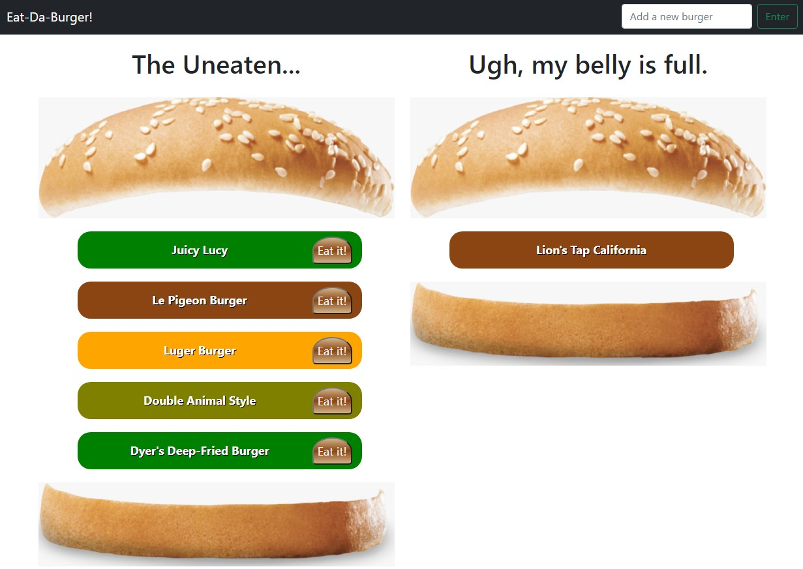

# Eat-Da-Burger

[](https://opensource.org/licenses/MIT)


## Description

A burger application called Eat-Da-Burger! that allows users to input the names of burgers they'd like to eat. The burgers show up in a list in the left hand burger on the screen until the user hits the "Eat it!" button, which then shifts the burger into the right hand burger on the screen.


## Table of Contents
  
  * [Installation](#installation)
  * [Testing](#testing)
  * [Useage](#useage)
  * [Technologies](#technologies)
  * [License](#license)
  * [Contact](#contact)
  * [Links](#links)


## Installation

'git clone' from [my repository](https://github.com/TimMartin13/burger) and then open the terminal window and navigate to the folder that holds the server.js file. Run

```
npm i
```
to install the *express* and *mysql* npm packages. 


## Testing

A small test is shown in this gif.

[}

## Useage

The easy way: click on the Heroku link in the Links section of this document.  You will find yourself at a page that looks similar to this:




Enter a burger in the area in the top, right corner that looks like this:


Once you click the "Enter" button, your burger will be entered into the burger on the left hand side in a layer that looks a bit like this:


When you decide to eat one of the burgers in the left burger, click the "Eat it!" push button:


The burger you chose, will move from the left hand burger to the right hand burger, signifying that you have eaten that burger. The burgers will grown and shrink as you go.

## Technologies

This project was written with Javascript, utilizing node.js, npm packages(express, mysql), HTML, CSS, Bootstrap, and Handlebars.

## License

Licensed under the [MIT](https://choosealicense.com/licenses/mit/) license 

## Contact

Email: timmartin13@gmail.com

Github: [TimMartin13](https://github.com/TimMartin13)

## Links

Heroku: https://calm-chamber-62526.herokuapp.com/

Github: https://github.com/TimMartin13/burger
